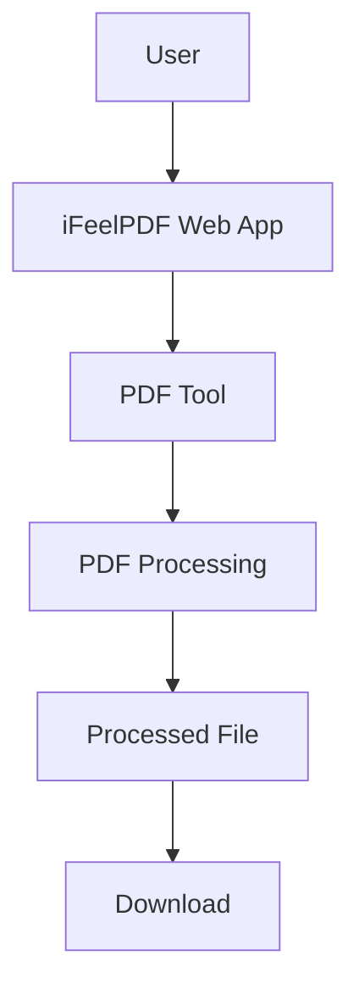

# iFeelPDF

> Simple PDF tools that just work.

[](https://ifeelpdf.lol)
[](https://twitter.com/iFeelPDF)
[]()

**[ifeelpdf.lol](https://ifeelpdf.lol)** · **[@iFeelPDF](https://twitter.com/iFeelPDF)**

---

## What is iFeelPDF?

iFeelPDF is a browser-first PDF utility platform built to make everyday PDF tasks simple.

Merging two files, compressing a document, splitting pages, converting an image — these are small jobs, but most PDF tools make them feel bigger than they are. iFeelPDF is built around one idea:

> PDF tools should feel like a great consumer product, not complicated enterprise software.

That means a clean interface, obvious actions, and no unnecessary friction between you and the result you need.

## Why iFeelPDF?

Most existing PDF tools share the same problems: cluttered layouts, heavy advertising, account walls for basic tasks, and settings panels that bury the one button you actually need.

iFeelPDF aims to be a cleaner alternative — a place where you can merge, split, compress, or convert a PDF without wading through anything else first. It's not trying to out-feature the incumbents; it's trying to get out of your way.

## Philosophy

- **Simple** — You should understand what a tool does the moment you open it.
- **Fast** — Minimal uploads, minimal waiting, minimal navigation.
- **Private** — Where technically possible, processing happens in your browser rather than on a remote server. *(See [Privacy](#privacy) below for what this means in practice.)*
- **Minimal** — The interface contains only what you need, nothing more.
- **Accessible** — Built for ordinary people, not just technical users.
- **Utility first** — Solving your problem beats decorative complexity, every time.

## Design Philosophy

> Utility software should feel as thoughtfully designed as a great consumer product.

iFeelPDF intentionally avoids the look and feel of traditional enterprise PDF software — dense toolbars, nested menus, and dashboards that require a manual. Instead, the design language favors:

- Clean layouts and strong typography
- Clear visual hierarchy and generous whitespace
- Obvious, unambiguous actions
- Friendly empty states, and clear loading/error states
- Responsive, mobile-friendly layouts
- Consistent, accessible components

What it deliberately avoids: heavy glassmorphism, oversized gradients, unnecessary animation, decorative UI for its own sake, sprawling dashboards, excessive popups, and dark patterns.

The product should feel: **Simple → Fast → Calm → Useful.**

## Features

> ⚠️ **A note on this section:** this README was generated without access to the iFeelPDF repository, so the feature list below reflects **planned / intended functionality** based on the product's stated scope — not confirmed, shipped features. Once the repository is available for inspection, this section should be split into **Available** (shipped) and **Planned** (roadmap), with only implemented features listed as available.

### PDF Organization
- Merge PDF
- Split PDF
- Reorder pages
- Extract pages
- Delete pages
- Rotate pages

### PDF Compression
- Compress PDF
- Reduce PDF file size

### PDF Conversion
- PDF ↔ JPG
- PDF ↔ PNG

### PDF Editing
- Add text
- Add images
- Draw / annotate
- Highlight

### PDF Utilities
- View and edit metadata
- Page management
- Document information

## Privacy

iFeelPDF is designed around a browser-first architecture:

```
User
  ↓
iFeelPDF
  ↓
Browser Processing
  ↓
Result
```

The intent behind this design is straightforward: where an operation can be done client-side, it should be, because that can mean:

- Files that don't need to leave your device
- Less server-side storage of user files
- Better privacy by default
- Faster results for operations suited to local processing
- Lower infrastructure overhead

**This section describes a design principle, not a verified guarantee.** Without access to the repository, this README cannot confirm which specific operations run entirely client-side versus which (if any) use server-side processing. That detail should be filled in once the codebase can be inspected — please don't take this as a claim that no data ever reaches a server.

## Architecture



This is a conceptual, high-level view of how a request flows through the app. It does not assert the presence of any specific backend service, database, authentication layer, or analytics system — none of those can be confirmed without repository access, and none are claimed here.

## Tech Stack

*Not specified / to be documented.*

This section requires inspecting `package.json`, lockfiles, and config files (`vite.config`, `next.config`, `tsconfig`, etc.) to report accurately. That inspection hasn't happened yet for this README — please regenerate this section once the repository is available, rather than relying on assumptions.

## Project Structure

*Not specified / to be documented.*

The actual directory tree should be pulled from the repository rather than invented. Once available, this section should include a real tree (e.g. `src/`, `components/`, `tools/`) with a short note on what each top-level directory contains.

## Getting Started

### Prerequisites

*To be documented once the repository's package manager and runtime requirements are confirmed.*

### Installation

```bash
git clone <repository-url>
cd ifeelpdf
# install command depends on the project's package manager (npm / pnpm / yarn / bun)
# run command depends on the project's dev script
```

Replace the placeholder commands above with the actual install/run commands once the repository's `package.json` scripts are confirmed — this README should not guess at `npm install` / `npm run dev` without checking which package manager the project actually uses.

### Development

Local dev server instructions will go here once confirmed from the repository.

## Environment Variables

*Not specified / to be documented.*

No `.env` or `.env.example` file was available to inspect. If iFeelPDF requires environment variables, document them here as:

| Variable | Description | Required |
|---|---|---|
| `EXAMPLE` | Description | Yes |

Never commit real secrets, API keys, or tokens to this file or the repository.

## Adding a New PDF Tool

A clean, recommended pattern for adding a new PDF utility:

```
Tool UI
   ↓
Input Validation
   ↓
PDF Processing Logic
   ↓
Output Validation
   ↓
Download / Result UI
```

Keeping PDF-processing logic separate from UI logic makes tools easier to test and reuse. If the existing codebase already follows a different pattern, follow that instead — this is a starting point, not a mandate.

## Performance

Working with PDFs in the browser comes with real constraints worth designing around:

- Large files and memory pressure
- Browser-imposed limitations on file handling
- Keeping the UI responsive during processing (e.g. via Web Workers, where applicable)
- Lazy loading and code splitting to keep initial load fast
- Avoiding unnecessary file copies
- Clear progress indicators and graceful error handling

Specific optimizations (e.g. whether Web Workers are actually in use) should only be documented here once confirmed in the codebase.

## Security

Principles for responsible PDF and file handling:

- Validate file types and sizes before processing
- Avoid unnecessary file persistence
- Sanitize user-controlled input (filenames, metadata, etc.)
- Handle malformed or corrupted PDFs safely
- Keep dependencies up to date
- Never expose secrets in client code or version control

This section describes intent and best practice, not a security guarantee.

## Accessibility

Accessibility is treated as a first-class product principle, not an afterthought:

- Full keyboard navigation
- Screen reader support
- Semantic HTML and clear labels
- Sufficient color contrast
- Visible focus states
- Meaningful, actionable error messages
- Accessible file upload controls

## Responsive Design

iFeelPDF is intended to work well across desktop, laptop, tablet, and mobile — PDF tools should stay easy to use even on a small screen. No specific CSS framework is assumed here unless confirmed by the repository.

## Testing

*Testing infrastructure is currently limited / not yet documented.*

Once test tooling is confirmed in the repository, this section should cover how to run tests and which frameworks (unit / integration / E2E) are in use.

## Production Build

*To be documented once the repository's build configuration is confirmed.*

```bash
# build command depends on the project's configured tooling
```

## Deployment

*Not specified / to be documented.*

No deployment configuration (Vercel, Cloudflare, Netlify, Docker, etc.) was available to confirm. The live product is available at **[ifeelpdf.lol](https://ifeelpdf.lol)**.

## Roadmap

- [ ] Verify current implementation against this README
- [ ] Confirm and document tech stack
- [ ] Confirm and document project structure
- [ ] Split Features into Available vs Planned
- [ ] Document testing setup (if any)
- [ ] Document deployment configuration
- [ ] Additional PDF tools
- [ ] Advanced PDF editing
- [ ] Further privacy-focused processing improvements

## Contributing

Contributions are welcome — from new PDF tools to performance, accessibility, UI/UX, bug fixes, documentation, testing, and browser-compatibility work.

1. Fork the repository
2. Create a branch for your change
3. Make your changes
4. Test locally
5. Open a pull request

If you're a PDF nerd, a UX perfectionist, or just someone who's tired of clunky PDF tools, you're in the right place.

## Bug Reports & Feature Requests

Found a bug, hit a browser compatibility issue, or have an idea for a new tool? Open an issue and include:

- What you were trying to do
- What happened instead
- Browser and OS
- Steps to reproduce (if applicable)
- A sample file, if you can share one (redact anything sensitive)

## Community

Follow along and share feedback:

- Website: [ifeelpdf.lol](https://ifeelpdf.lol)
- X / Twitter: [@iFeelPDF](https://twitter.com/iFeelPDF)

## The People Behind iFeelPDF

**Ketan**
GitHub: [@ketanofc](https://github.com/ketanofc) · X: [@ketanofc](https://twitter.com/ketanofc)

**Sarniva**
GitHub: [@sarniva](https://github.com/sarniva) · X: [@sarniva_](https://twitter.com/sarniva_)

## License

*A license has not yet been specified.*

## Disclaimer

PDF processing results can depend on the structure and quality of the source document, as well as the capabilities of the browser being used. iFeelPDF aims for reliable results but cannot guarantee perfect output for every PDF.

---

*This README was generated without direct access to the iFeelPDF repository. Sections marked "not specified / to be documented" should be filled in from the actual codebase rather than assumed.*
